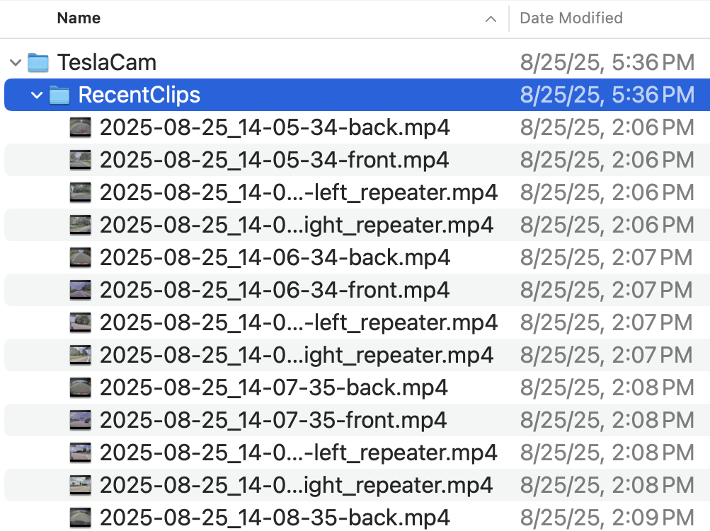

# Video Ingestion Pipeline

This directory contains the video ingestion pipeline for raw Tesla driving footage extracted via USB drive. These scripts process and prepare raw video files for use in driving simulations, before collecting user behavioral data.

## Tesla Video Data Structure

Tesla vehicles record footage from multiple cameras simultaneously, creating separate video files for each camera angle as shown below:



The raw footage contains videos from four different cameras:
- **Front camera**: Primary view used for our research
- **Left camera**: Left side perspective  
- **Right camera**: Right side perspective
- **Back camera**: Rear view perspective

Since our research focuses on hazardous driving detection from the driver's perspective, we only process the **front camera** footage.

## Processing Pipeline

### Step 1: `process_raw_data.py` - Combine Raw Tesla Footage
**Purpose**: Extracts and combines multiple 1-minute front camera videos into a single continuous video file.

**Context**: Tesla saves footage in 1-minute segments across different camera angles. This script filters for front camera videos only and concatenates them chronologically.

**What it does**:
- Identifies front camera videos from the mixed camera footage
- Combines multiple 1-minute front camera segments into one continuous video
- Uses FFmpeg to concatenate videos while maintaining quality (copy codec)
- Outputs combined videos ready for segmentation

**How to run**:
```bash
python process_raw_data.py
```
**Note**: Update the `video_folder` and `output_folder` paths in the script before running.

### Step 2: `split_processed_videos.py` - Create Analysis Segments  
**Purpose**: Splits the large combined front camera video into smaller 15-second segments suitable for simulation.

**Context**: 15-second clips provide optimal length for user attention analysis while maintaining contextual driving scenarios.

**What it does**:
- Takes the combined front camera video from Step 1
- Splits into 15-second segments using FFmpeg
- Resets timestamps for each segment
- Outputs numbered video segments ready for simulation use

**How to run**:
```bash
python split_processed_videos.py
```
**Note**: Update the `input_folder` and `output_folder` paths, and modify `camera_type` if needed.

### Step 3: `combineSubFolderWithSplitVideos.py` - Batch Management
**Purpose**: Combines video segments from multiple processing batches into a unified dataset with sequential naming.

**Context**: When processing multiple Tesla data extractions, this script merges all segments into a single organized dataset.

**What it does**:
- Processes videos from multiple batch folders
- Handles duplicate filenames by renaming them uniquely  
- Renames all videos sequentially as `video1.mp4`, `video2.mp4`, etc.
- Supports multiple video formats (.mp4, .avi, .mov, .mkv)

**How to run**:
```bash
python combineSubFolderWithSplitVideos.py
```
**Note**: Update the `input_folders` list and `output_folder` path in the script before running.

## Requirements
- Python 3.x
- FFmpeg (must be installed and accessible from command line)

## Data Flow
```
Tesla USB Drive → Raw Mixed Camera Footage → Front Camera Only → Combined Video → 15s Segments → Unified Dataset
```

## Workflow
1. **Step 1**: Use `process_raw_data.py` to extract and combine front camera footage
2. **Step 2**: Use `split_processed_videos.py` to create 15-second simulation-ready segments  
3. **Step 3**: Use `combineSubFolderWithSplitVideos.py` to merge segments from different Tesla data batches